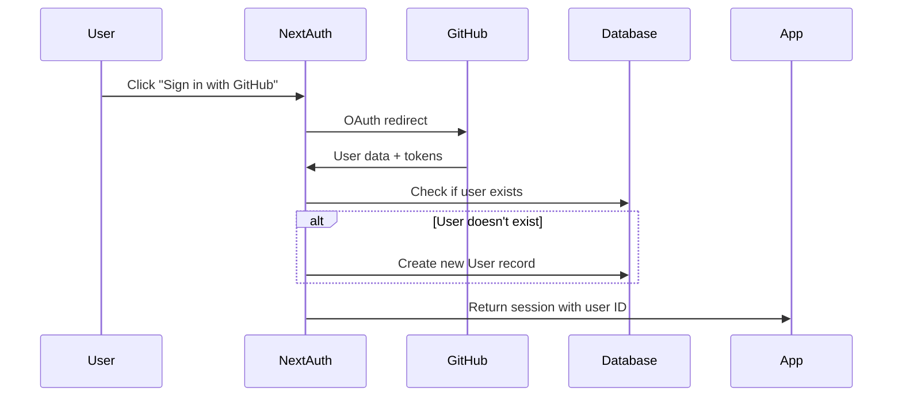

# User Settings Architecture - Kaiboard

## Overview

This document explains how user account creation and settings management works in Kaiboard, addressing the separation between NextAuth user sessions and our application's user data storage.

## Architecture Components

### 1. Authentication Layer (NextAuth.js)
- **Purpose**: Handles OAuth authentication with GitHub
- **Session Strategy**: JWT-based (Edge Runtime compatible)
- **Provider**: GitHub OAuth

### 2. Database Layer (Prisma + PostgreSQL)
- **User Model**: Stores extended user data and application settings
- **Account Model**: Stores OAuth provider information (NextAuth standard)
- **Session Model**: For database session tracking (not used with JWT strategy)

### 3. User Creation Flow



## Database Schema

### User Model
```prisma
model User {
  id            String          @id @default(cuid())
  name          String?
  email         String          @unique
  emailVerified DateTime?
  image         String?
  
  // Kaiboard specific fields
  timezone      String?         @default("UTC")
  country       String?         // ISO country code (e.g., "US", "FR", "JP")
  role          UserRole        @default(MEMBER)
  
  // Relations
  accounts      Account[]
  sessions      Session[]
  teams         TeamMember[]
  createdMeetings Meeting[]
  meetingParticipants MeetingParticipant[]

  createdAt DateTime @default(now())
  updatedAt DateTime @updatedAt
}
```

## Auth Configuration (auth.ts)

### Key Callbacks

1. **signIn Callback**
   - Triggered when user signs in with GitHub
   - Creates User record in database if doesn't exist
   - Ensures every authenticated user has a database record

2. **jwt Callback**
   - Adds database user ID to JWT token
   - Enables API routes to identify users

3. **session Callback**
   - Adds user ID to session object
   - Makes user ID available in client components

## Settings Management

### API Endpoint: `/api/user/settings`
- **Method**: PATCH
- **Purpose**: Update user timezone, country, and display name
- **Authentication**: Requires valid session with user ID

### Settings Page: `/app/settings/page.tsx`
- Server-side renders with user data from database
- Passes data to client component for interactivity

### Settings Client: `UserSettingsClient`
- **Features**:
  - Searchable country dropdown (195+ countries)
  - Searchable timezone dropdown (UTC-12 to UTC+14)
  - Real-time time preview
  - Form validation and submission

## Data Flow

### User Registration Flow
1. User clicks "Sign in with GitHub"
2. NextAuth redirects to GitHub OAuth
3. GitHub returns user profile data
4. `signIn` callback checks if user exists in database
5. If new user, creates User record with defaults:
   - `timezone`: "UTC"
   - `country`: null
   - `role`: "MEMBER"
6. JWT token includes database user ID
7. Session object includes user ID for API access

### Settings Update Flow
1. User modifies settings in `/settings` page
2. Client submits PATCH request to `/api/user/settings`
3. API validates session and extracts user ID
4. Prisma updates User record in database
5. Returns updated user data to client
6. Client shows success confirmation

## Key Benefits

1. **Separation of Concerns**
   - NextAuth handles authentication
   - Prisma handles application data

2. **Extensibility**
   - Easy to add new user fields
   - Clean database relationships

3. **Data Integrity**
   - Every authenticated user has a database record
   - Consistent user identification across app

4. **Edge Runtime Compatible**
   - JWT sessions work with Vercel Edge Runtime
   - No database adapter dependency

## Security Considerations

1. **User ID Validation**
   - All API routes verify session contains valid user ID
   - User can only modify their own settings

2. **Data Validation**
   - Country codes validated against ISO standards
   - Timezone values validated against UTC standards

3. **Default Values**
   - Safe defaults prevent null/undefined errors
   - UTC timezone ensures consistent time handling

## Future Enhancements

1. **Profile Images**
   - Store custom avatars beyond GitHub profile image
   - Image upload and processing

2. **Notification Preferences**
   - Email notification settings
   - Meeting reminder preferences

3. **Calendar Integration**
   - Google Calendar sync settings
   - Outlook integration preferences

4. **Team Settings**
   - Default meeting durations
   - Working hours preferences

## Migration Commands

When adding new user fields:

```bash
# Add field to schema.prisma
# Then run:
npx prisma migrate dev --name add_new_field
npx prisma generate
```

## Environment Variables Required

```env
GITHUB_CLIENT_ID=your_github_client_id
GITHUB_CLIENT_SECRET=your_github_client_secret
NEXTAUTH_SECRET=your_nextauth_secret
DATABASE_URL=your_postgresql_url
DIRECT_URL=your_direct_postgresql_url
``` 